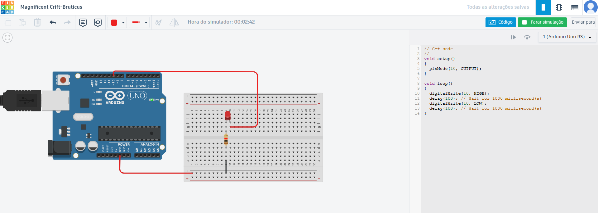
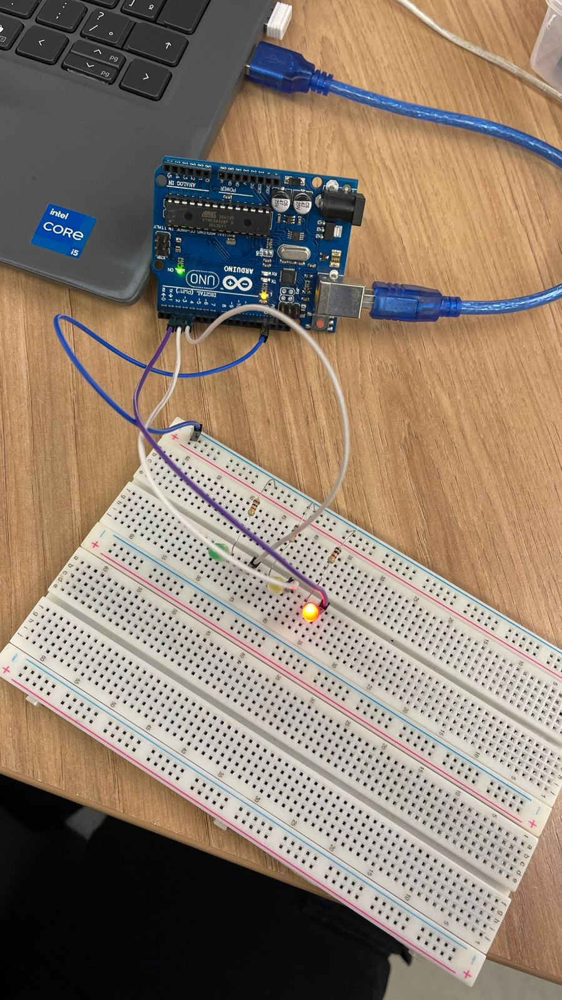

# Estudo Arduino

Repositório criado para estudos e pequenos projetos com Arduino.

## Como usar os exemplos

- Pré-requisitos: Arduino IDE (ou PlatformIO), placa Arduino compatível (ex.: UNO) e cabo USB.
- Passos:
  1. Abra a IDE e selecione a placa e a porta correta.
  2. Copie o código do exemplo para um novo sketch.
  3. Clique em Verificar/Compilar e depois em Carregar para enviar à placa.

## Blink - Piscar LED (Interno)

Pisca o LED interno da placa (LED_BUILTIN) usando `millis()` para criar um intervalo sem travar o loop. Isso evita `delay()` e permite que o programa execute outras tarefas enquanto o LED pisca.

<div align="center">
  
</div>

Código:

```cpp
const int ledPin = LED_BUILTIN;  // LED interno da placa

int estadoLed = LOW;             // estado atual do LED

unsigned long previousMillis = 0;  // marcação de tempo anterior
const long intervalO = 1000;       // intervalo de 1 segundo

void setup() {
  pinMode(ledPin, OUTPUT);
}

void loop() {
  unsigned long currentMillis = millis();
  if (currentMillis - previousMillis >= intervalO) {
    previousMillis = currentMillis;  // atualiza a marcação de tempo

    // alterna o estado do LED sem bloquear a execução
    if (estadoLed == LOW) {
      estadoLed = HIGH;
    } else {
      estadoLed = LOW;
    }
    digitalWrite(ledPin, estadoLed);
  }
}
```

## Blink - Piscar LED (Externo)

Mesmo conceito do exemplo anterior, mas utilizando um LED conectado a um pino digital da placa.

<a href="https://www.tinkercad.com/things/fSUKC8K3kRB/editel?sharecode=qyGqongasKDWY-93Q95CTBGea8U8OLad5e_bY3WLHBM" target="_blank">Link do projeto no Tinkercad</a>

<div align="center">
  
</div>

Montagem sugerida:

- 1 LED e 1 resistor de 220–330 Ω.
- Anodo do LED no pino digital escolhido (ex.: D8) através do resistor.
- Catodo do LED no GND da placa.
- No código, troque `LED_BUILTIN` pelo número do pino utilizado (ex.: `const int ledPin = 8;`).

## Bônus - Semáforo com LEDs

Mini projeto que simula um semáforo simples usando três LEDs e tempos distintos para cada cor.

<div align="center">
  
</div>

<div align="center">
  
</div>

Montagem:

- Pinos digitais usados: vermelho no D2, amarelo no D3, verde no D4.
- Cada LED deve ter um resistor de 220–330 Ω em série.
- O outro terminal de cada LED vai ao GND.

Lógica:

- Vermelho aceso por 1,5 s → Amarelo por 0,3 s → Verde por 1,5 s, repetindo em ciclo.

Código:

```cpp
#define vermelho 2
#define amarelo 3
#define verde 4

void setup() {
  pinMode(vermelho, OUTPUT);
  pinMode(amarelo, OUTPUT);
  pinMode(verde, OUTPUT);
}

void acendeVermelho(int tempo) {
  digitalWrite(vermelho, HIGH);
  digitalWrite(amarelo, LOW);
  digitalWrite(verde, LOW);
  delay(tempo);
}

void acendeAmarelo(int tempo) {
  digitalWrite(vermelho, LOW);
  digitalWrite(amarelo, HIGH);
  digitalWrite(verde, LOW);
  delay(tempo);
}

void acendeVerde(int tempo) {
  digitalWrite(vermelho, LOW);
  digitalWrite(amarelo, LOW);
  digitalWrite(verde, HIGH);
  delay(tempo);
}

void loop() {
  acendeVermelho(1500);
  acendeAmarelo(300);
  acendeVerde(1500);
}
```
